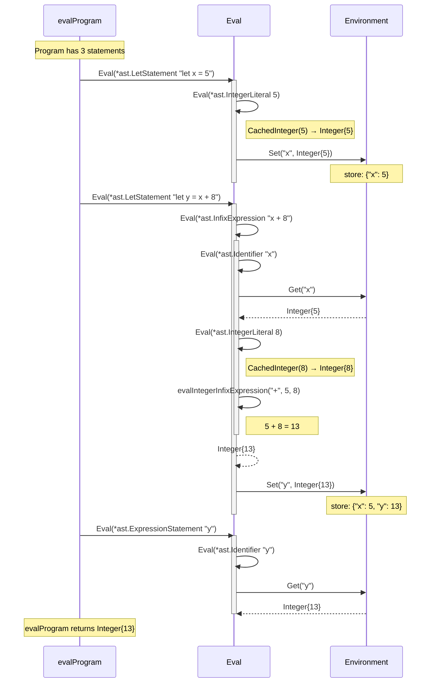
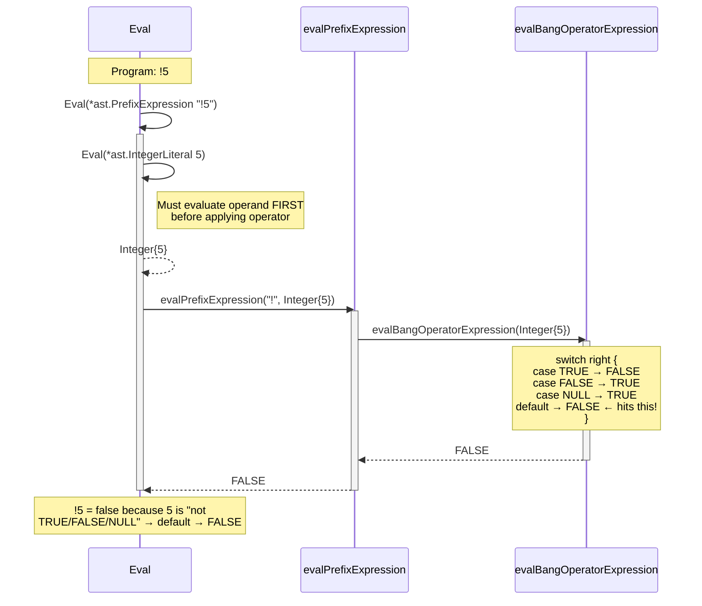
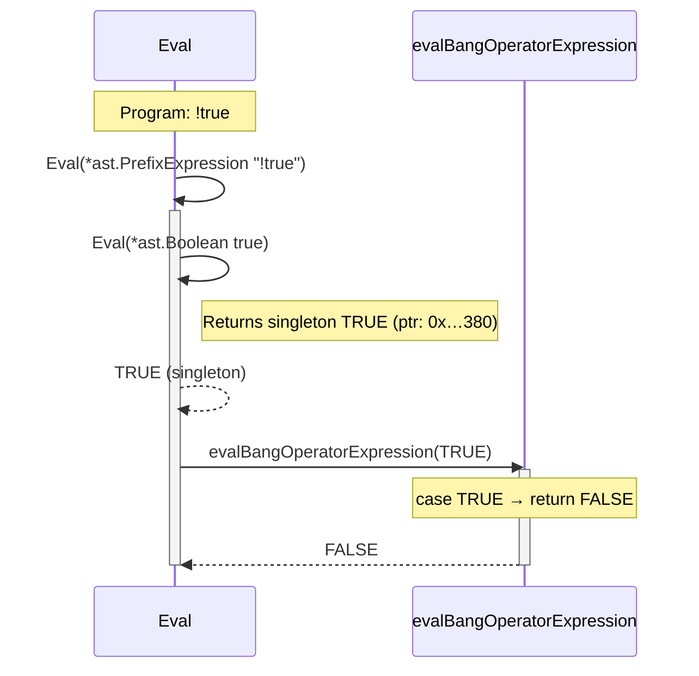
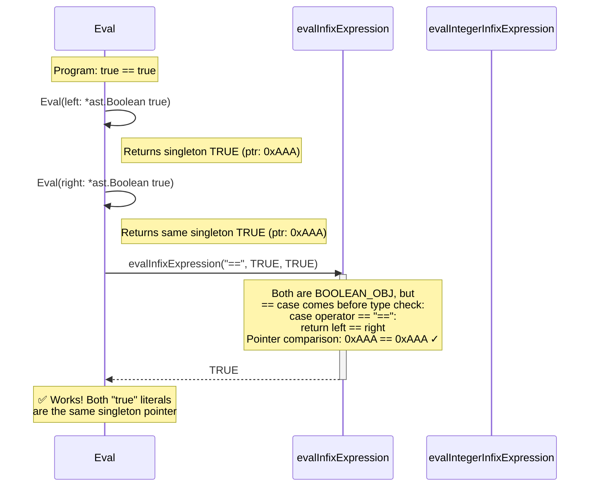
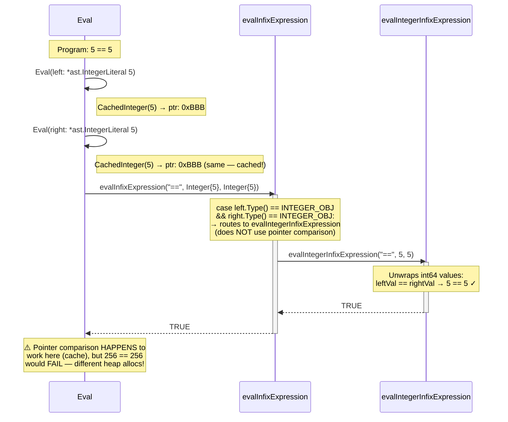
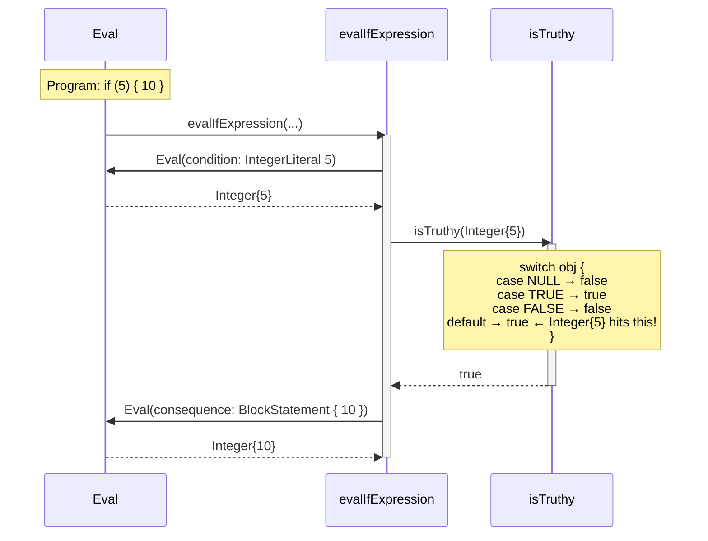
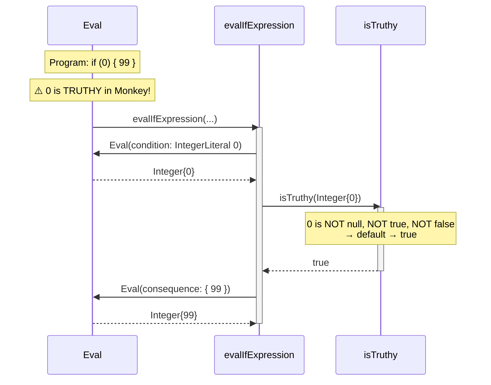
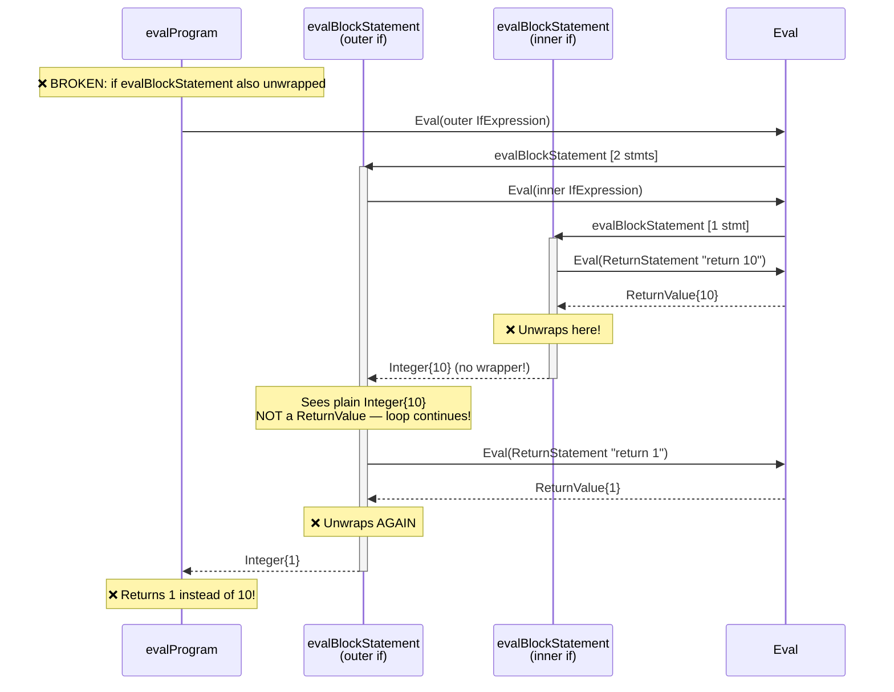
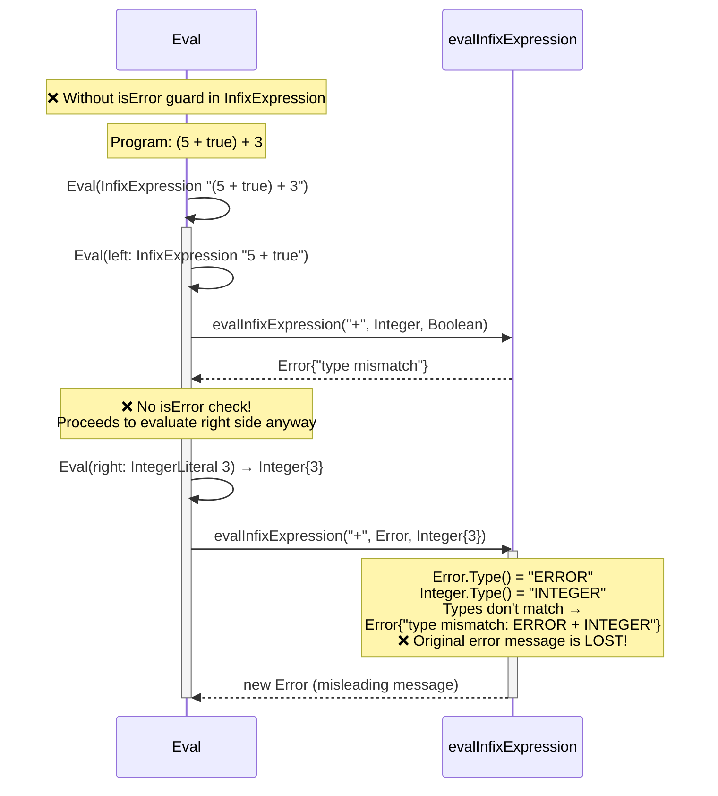
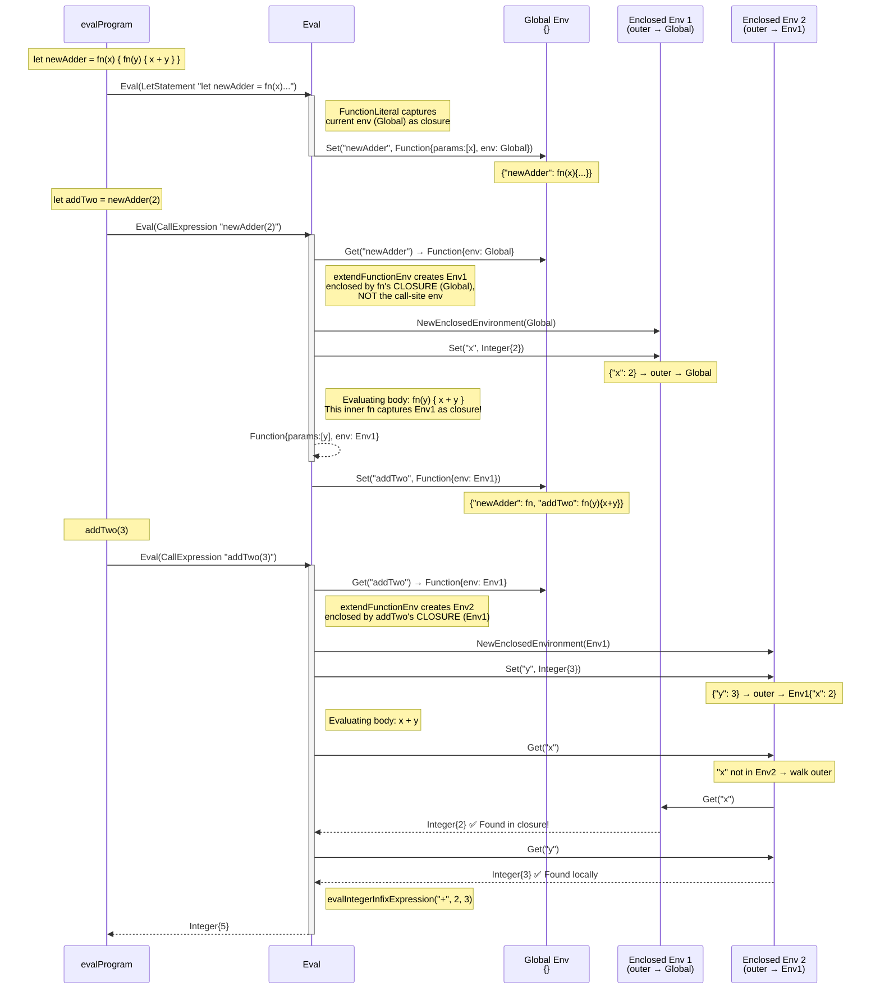

# Evaluator Walkthrough — Sequence Diagrams & Code References

Sequence diagrams for the key discussion questions from [Discussion #163](https://github.com/github/tech-book-club/discussions/163), traced through the Monkey evaluator.

---

## Q1: Tracing `let x = 5; let y = x + 8; y`

> At each step: which AST node type is being evaluated, what does Eval return, and what changes in the environment?



**Code references:**
- `Eval` type switch dispatches each node: [`evaluator/evaluator.go:15-94`](evaluator/evaluator.go#L15-L94)
- `LetStatement` evaluates RHS then calls `env.Set()`: [`evaluator/evaluator.go:35-40`](evaluator/evaluator.go#L35-L40)
- `InfixExpression` evaluates left, right, then dispatches: [`evaluator/evaluator.go:56-67`](evaluator/evaluator.go#L56-L67)
- `evalIntegerInfixExpression` does the arithmetic: [`evaluator/evaluator.go:194-222`](evaluator/evaluator.go#L194-L222)
- `Identifier` lookup via `env.Get()`: [`evaluator/evaluator.go:72-73`](evaluator/evaluator.go#L72-L73) → [`object/environment.go:19-25`](object/environment.go#L19-L25)
- `evalProgram` iterates statements, unwraps return/error: [`evaluator/evaluator.go:97-112`](evaluator/evaluator.go#L97-L112)

---

## Q5: Prefix Expressions — `!5` and `!true`

> Why does the order matter? What does `evalBangOperatorExpression` do for `!5`?





**Code references:**
- Operand evaluated first, then operator applied: [`evaluator/evaluator.go:49-54`](evaluator/evaluator.go#L49-L54)
- `evalBangOperatorExpression` — `default` case makes all non-boolean/null values falsy under `!`: [`evaluator/evaluator.go:172-183`](evaluator/evaluator.go#L172-L183)
- Boolean singletons (`TRUE`/`FALSE`): [`evaluator/evaluator.go:9-12`](evaluator/evaluator.go#L9-L12)

---

## Q6: Pointer Comparison — `==` for Booleans vs Integers

> Why does pointer comparison work for booleans but not integers?





**Code references:**
- `evalInfixExpression` — integer path vs pointer-comparison path: [`evaluator/evaluator.go:152-170`](evaluator/evaluator.go#L152-L170)
  - Line 157: integers routed to value comparison
  - Line 159-160: `==` uses `left == right` (pointer) for non-integers
- `evalIntegerInfixExpression` — unwraps `int64`, compares values: [`evaluator/evaluator.go:214-215`](evaluator/evaluator.go#L214-L215)
- Integer cache (0–255 share pointers): [`object/object.go:39-57`](object/object.go#L39-L57)
- Boolean singletons guarantee pointer equality: [`evaluator/evaluator.go:9-12`](evaluator/evaluator.go#L9-L12)

---

## Q8: Truthiness — `if (5) { 10 }` and `if (0) { 99 }`

> `isTruthy` returns true for everything that isn't NULL or FALSE — including 0!





**Code references:**
- `evalIfExpression` calls `isTruthy` on condition result: [`evaluator/evaluator.go:224-240`](evaluator/evaluator.go#L224-L240)
- `isTruthy` — only `NULL` and `FALSE` are falsy, everything else (including `0`) is truthy: [`evaluator/evaluator.go:254-265`](evaluator/evaluator.go#L254-L265)

---

## Q9: Return Statements — Wrapping Propagates Without Unwrapping

> Why does `evalBlockStatement` NOT unwrap, while `evalProgram` DOES?

```mermaid
sequenceDiagram
    participant P as evalProgram
    participant B1 as evalBlockStatement<br/>(outer if)
    participant B2 as evalBlockStatement<br/>(inner if)
    participant E as Eval

    Note over P: if (true) { if (true) { return 10; } return 1; }

    P->>E: Eval(outer IfExpression)
    E->>B1: evalBlockStatement [2 stmts]
    activate B1
    B1->>E: Eval(inner IfExpression)
    E->>B2: evalBlockStatement [1 stmt]
    activate B2

    B2->>E: Eval(*ast.ReturnStatement "return 10")
    E->>E: Eval(IntegerLiteral 10)
    E-->>E: Integer{10}
    Note right of E: Wraps: ReturnValue{Integer{10}}
    E-->>B2: ReturnValue{10}

    Note over B2: Sees RETURN_VALUE_OBJ →<br/>propagates WITHOUT unwrapping
    B2-->>B1: ReturnValue{10}
    deactivate B2

    Note over B1: Sees RETURN_VALUE_OBJ →<br/>propagates WITHOUT unwrapping<br/>⚡ "return 1" is NEVER reached!
    B1-->>P: ReturnValue{10}
    deactivate B1

    Note over P: evalProgram UNWRAPS:<br/>result.Value → Integer{10}
    P-->>P: Integer{10}
```



**Code references:**
- `ReturnStatement` wraps value in `ReturnValue`: [`evaluator/evaluator.go:28-33`](evaluator/evaluator.go#L28-L33)
- `evalBlockStatement` — checks for `RETURN_VALUE_OBJ` but does **not** unwrap, just propagates: [`evaluator/evaluator.go:114-132`](evaluator/evaluator.go#L114-L132) (lines 124-127)
- `evalProgram` — **does** unwrap `ReturnValue` to get the inner value: [`evaluator/evaluator.go:97-112`](evaluator/evaluator.go#L97-L112) (lines 104-105)
- `unwrapReturnValue` helper (used by `applyFunction`): [`evaluator/evaluator.go:319-325`](evaluator/evaluator.go#L319-L325)

---

## Q10: Error Propagation — `isError` Guards

> What does the `isError` guard prevent? What if you removed one?

```mermaid
sequenceDiagram
    participant P as evalProgram
    participant E as Eval
    participant Infix as evalInfixExpression

    Note over P: Program: 5 + true; 10

    P->>E: Eval(ExpressionStatement "5 + true")
    activate E
    E->>E: Eval(InfixExpression "5 + true")
    activate E
    E->>E: Eval(IntegerLiteral 5) → Integer{5}
    E->>E: Eval(Boolean true) → TRUE
    E->>Infix: evalInfixExpression("+", Integer, Boolean)
    activate Infix
    Note over Infix: left.Type() ≠ right.Type()<br/>→ Error{"type mismatch: INTEGER + BOOLEAN"}
    Infix-->>E: Error
    deactivate Infix
    deactivate E
    deactivate E

    Note over P: evalProgram sees Error →<br/>short-circuits, returns Error<br/>⚡ Statement "10" is NEVER evaluated
```



**Code references:**
- `isError` helper: [`evaluator/evaluator.go:271-276`](evaluator/evaluator.go#L271-L276)
- Guard in `InfixExpression` — removing this would lose original errors: [`evaluator/evaluator.go:58-59`](evaluator/evaluator.go#L58-L59)
- Guard in `LetStatement`: [`evaluator/evaluator.go:37-38`](evaluator/evaluator.go#L37-L38)
- `evalProgram` short-circuits on Error: [`evaluator/evaluator.go:106-107`](evaluator/evaluator.go#L106-L107)

---

## Q11: Closures — `newAdder(2)(3)` — Where Does the `2` Live?

> Walk through what happens when `newAdder(2)` is called and then `addTwo(3)` is called.



**Key insight:** `extendFunctionEnv` on line 310 uses `fn.Env` (the environment captured at **definition** time), not the caller's environment. This is why `addTwo` can still find `x=2` — it's in the closure chain.

**Code references:**
- `FunctionLiteral` captures current `env` as closure: [`evaluator/evaluator.go:75-78`](evaluator/evaluator.go#L75-L78)
- `applyFunction` calls `extendFunctionEnv`: [`evaluator/evaluator.go:295-304`](evaluator/evaluator.go#L295-L304)
- `extendFunctionEnv` — creates enclosed env from **`fn.Env`** (closure), not call-site: [`evaluator/evaluator.go:306-317`](evaluator/evaluator.go#L306-L317)
- `Environment.Get` walks the `outer` chain recursively: [`object/environment.go:19-25`](object/environment.go#L19-L25)
- `NewEnclosedEnvironment` links outer pointer: [`object/environment.go:3-7`](object/environment.go#L3-L7)
- `Function` object stores `Env` field (the closure environment): [`object/object.go:85-89`](object/object.go#L85-L89)
